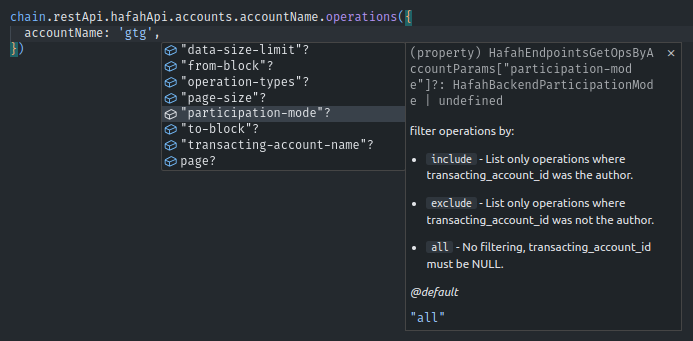

# Extending Chain

When writing an advanced Hive blockchain application, you may want to add more APIs to the standard set of Wax methods. There is a feature in Wax called `extend` or `extendRest` (for REST API) allowing you to extend Wax Chain with fully-typed requests with full typization.



## Manually extending JSON-RPC API

+++ JavaScript

:::code source="../../static/snippets/src/typescript/api/extend-api/interface-extend.ts" language="typescript" title="Test it yourself: [src/typescript/api/extend-api/interface-extend.ts](https://stackblitz.com/github/openhive-network/wax-doc-snippets?file=src%2Ftypescript%2Fapi%2Fextend-api%2Finterface-extend.ts&startScript=test-api-extend-api-interface-extend)" :::

=== Output

```javascript
{ "is_known": false }
```

===

As you can see in the example, there is a type called: `TWaxApiRequest` which as a first template argument takes a user input type (that the user will have to pass to the API request function). It may be an `interface`, but it can also be a standard type, like: `boolean`, `number`, `Array` and so on. The second argument should be the response type (type of `result` in the snippet above).

+++ Python

:::code source="../../static/snippets/src/python/api/extend_api/interface_extend.py" language="python" title="Test it yourself: [src/python/api/extend_api/interface_extend.py](https://github.com/codespaces/new?repo=openhive-network/wax-doc-snippets&ref=kudmich/python-snippets&file=workspaces/wax-doc-snippets/src/python/api/extend_api/interface_extend.py)" :::

=== Output

```python
BlockHeaderResponse(header=BlockHeader(previous='0000007a514fd4034a39ff8bb4225760ccf61154', timestamp='2016-03-24T16:11:39', witness='initminer', transaction_merkle_root='0000000000000000000000000000000000000000', extensions=[]))
```

===

+++

## Manually extending REST API

+++ JavaScript

:::code source="../../static/snippets/src/typescript/api/extend-api/interface-extend-rest.ts" language="typescript" title="Test it yourself: [src/typescript/api/extend-api/interface-extend-rest.ts](https://stackblitz.com/github/openhive-network/wax-doc-snippets?file=src%2Ftypescript%2Fapi%2Fextend-api%2Finterface-extend-rest.ts&startScript=test-api-extend-api-interface-extend-rest)" :::

=== Output

```javascript
{
  previous: '00bc614d58b1745f3347e4f55f35fe68c82ad0d1',
  timestamp: '2017-05-29T06:28:42',
  witness: 'good-karma',
  transaction_merkle_root: '3843fd6daebf3742ecc84fe5926df037131a66a6',
  extensions: []
}
```

===

+++ Python

:::code source="../../static/snippets/src/python/api/extend_api/interface_extend_rest.py" language="python" title="Test it yourself: [src/python/api/extend_api/interface_extend_rest.py](https://github.com/codespaces/new?repo=openhive-network/wax-doc-snippets&ref=kudmich/python-snippets&file=workspaces/wax-doc-snippets/src/python/api/extend_api/interface_extend_rest.py)" :::

+++

## Automatically extending API

Thanks to the OpenAPI specifications, we can automatically generate API definitions for both JSON-RPC and REST API. This way you don't have to manually define each method, its parameters, and return types. If you have your own API with OpenAPI spec, you can also automatically generate the types and use them with Wax.

+++ JavaScript

When dealing with TypeScript and JavaScript, you can use the following package to automatically generate types from OpenAPI spec:

[!ref icon="../../static/npm.svg" target="_blank" text="View **WAX Spec Generator** package on npmjs 🡭"](https://www.npmjs.com/package/@hiveio/wax-spec-generator)

+++ Python

TBA

+++

### Use JSON-RPC API packages

For basic wax usage, the default API methods, shipped with the package are usually sufficient. However, if you want to use more advanced API methods, you can extend the default API with additional methods. Defining a whole set of methods can be tedious, so Wax provides a way to automatically extend the API with additional methods, using the `extend` method and external packages with automatically generated spec from OpenAPI.

+++ JavaScript

[!ref icon="../../static/npm.svg" target="_blank" text="View **JSON-RPC** API package on npmjs 🡭"](https://npmjs.com/package/@hiveio/wax-api-jsonrpc)

Example usage:

```javascript
import JsonRPC from "@hiveio/wax-api-jsonrpc";

const extendedChain = chain.extend(JsonRPC);
// You can now call extendedChain.api[apiType][apiMethod](dataToSend)
```

+++ Python

TBA

+++

### Use REST API packages

As you can see it is a little complicated and REST API can potentially change frequently as it is not consensus-based, so we created multiple packages, automatically generating API definitions from OpenAPI definitions for each endpoint. You would only need to install the package and use the generated types:

+++ JavaScript

[!ref icon="../../static/npm.svg" target="_blank" text="View **HAfAH** API package on npmjs 🡭"](https://npmjs.com/package/@hiveio/wax-api-hafah)
[!ref icon="../../static/npm.svg" target="_blank" text="View **Block Explorer** API package on npmjs 🡭"](https://npmjs.com/package/@hiveio/wax-api-hafbe)
[!ref icon="../../static/npm.svg" target="_blank" text="View **Reputation Tracker** API package on npmjs 🡭"](https://npmjs.com/package/@hiveio/wax-api-reputation-tracker)
[!ref icon="../../static/npm.svg" target="_blank" text="View **Balance Tracker** API package on npmjs 🡭"](https://npmjs.com/package/@hiveio/wax-api-balance-tracker)

Example usage:

```javascript
import HAfAH from "@hiveio/wax-api-hafah";

const extendedChain = chain.extendRest(HAfAH);
// You can now call extendedChain.restApi...<methodNames>()
```

+++ Python

- **HAfAH**: [`wax-api-hafah`](https://gitlab.syncad.com/hive/HAfAH/-/packages)
- **Block Explorer**: [`wax-api-hafbe`](https://gitlab.syncad.com/hive/haf_block_explorer/-/packages)
- **Reputation Tracker**: [`wax-api-reputation-tracker`](https://gitlab.syncad.com/hive/reputation_tracker/-/packages)
- **Balance Tracker**: [`wax-api-balance-tracker`](https://gitlab.syncad.com/hive/balance_tracker/-/packages)

:::code source="../../static/snippets/src/python/api/extend_api/interface_extend_rest_automatically.py" language="python" title="Test it yourself: [src/python/api/extend_api/interface_extend_rest_automatically.py](https://github.com/codespaces/new?repo=openhive-network/wax-doc-snippets&ref=kudmich/python-snippets&file=workspaces/wax-doc-snippets/src/python/api/extend_api/interface_extend_rest_automatically.py)" :::
==- Output:

```log
Reputation: 76
Version: 8393e19323be1002a16df9826423c1fb442b4a12
Last synced block: 99305697
```

===

+++
