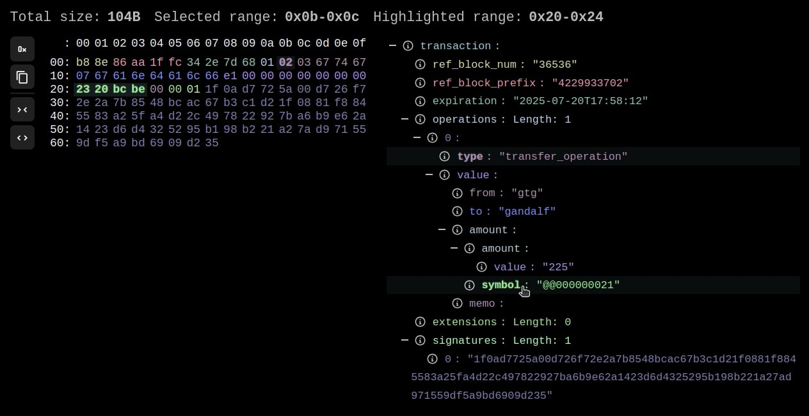

# Binary representation of transaction

The `ITransaction` interface also supports conversion to and from binary formats. This means you can easily serialize and deserialize transaction objects for efficient storage or deep analysis.

## Overview

The `ITransaction` interface provides methods for:

- Serializing transaction objects to binary format
- Serializing transaction objects to binary metadata format, describing their structure and fields
- Deserializing binary data back into transaction objects

Thanks to those capabilities, we were able to create the Binary View Component (available through the [Transaction Inspector app](https://tx.openhive.network)):



## Conversion to binary format

With this conversion method, you can decide to strip to the unsigned transaction, which removes any information about the signatures container (by default the signatures container is present):

+++ JavaScript

```typescript
import { createHiveChain } from '@hiveio/wax';

// Initialize hive chain interface
const chain = await createHiveChain();

// Initialize an online transaction object
const tx = await chain.createTransaction();

// Declare example operation
const operation = {
  vote_operation: {
    voter: "gtg",
    author: "gtg",
    permlink: "hello-world",
    weight: 2200
  }
};

// Push operation into the transction
tx.pushOperation(operation);

// Display transaction in the binary form
console.log(tx.toBinaryForm());
```

=== Output

```javascript
"8059b32ca6018b9fb568010003677467036774670b68656c6c6f2d776f726c6498080000"
```

===

+++ Python

TBA

+++

## Retrieving transaction binary metadata

You can also retrieve the binary metadata, which in details describes the structure and fields of the transaction, along their size and offset in bytes:

+++ JavaScript

```typescript
import { createHiveChain } from '@hiveio/wax';

// Initialize hive chain interface
const chain = await createHiveChain();

// Initialize an online transaction object
const tx = await chain.createTransaction();

// Declare example operation
const operation = {
  vote_operation: {
    voter: "gtg",
    author: "gtg",
    permlink: "hello-world",
    weight: 2200
  }
};

// Push operation into the transction
tx.pushOperation(operation);

// Display transaction binary view metadata
console.log(tx.binaryViewMetadata);
```

==- Output

```javascript
{
  binary: '995a8f30236ddba2b568010003677467036774670b68656c6c6f2d776f726c6498080000',
  offsets: [
    {
      key: 'ref_block_num',
      type: 'scalar',
      offset: 0,
      size: 2,
      value: '23193',
      length: undefined,
      children: undefined
    },
    {
      key: 'ref_block_prefix',
      type: 'scalar',
      offset: 2,
      size: 4,
      value: '1831022735',
      length: undefined,
      children: undefined
    },
    {
      key: 'expiration',
      type: 'scalar',
      offset: 6,
      size: 4,
      value: '2025-09-01T13:42:51',
      length: undefined,
      children: undefined
    },
    {
      key: 'operations',
      type: 'array',
      offset: 10,
      size: 24,
      value: 'Length: 1',
      length: 1,
      children: [
        {
          key: '0',
          type: 'object',
          offset: 11,
          size: 23,
          value: undefined,
          length: undefined,
          children: [
            {
              key: 'type',
              type: 'scalar',
              offset: 11,
              size: 1,
              value: 'vote_operation',
              length: undefined,
              children: undefined
            },
            {
              key: 'value',
              type: 'object',
              offset: 12,
              size: 22,
              value: undefined,
              length: undefined,
              children: [
                {
                  key: 'voter',
                  type: 'scalar',
                  offset: 12,
                  size: 4,
                  value: 'gtg',
                  length: undefined,
                  children: undefined
                },
                {
                  key: 'author',
                  type: 'scalar',
                  offset: 16,
                  size: 4,
                  value: 'gtg',
                  length: undefined,
                  children: undefined
                },
                {
                  key: 'permlink',
                  type: 'scalar',
                  offset: 20,
                  size: 12,
                  value: 'hello-world',
                  length: undefined,
                  children: undefined
                },
                {
                  key: 'weight',
                  type: 'scalar',
                  offset: 32,
                  size: 2,
                  value: '2200',
                  length: undefined,
                  children: undefined
                }
              ]
            }
          ]
        }
      ]
    },
    {
      key: 'extensions',
      type: 'array',
      offset: 34,
      size: 1,
      value: 'Length: 0',
      length: 0,
      children: []
    },
    {
      key: 'signatures',
      type: 'array',
      offset: 35,
      size: 1,
      value: 'Length: 0',
      length: 0,
      children: []
    }
  ]
}
```

===

+++ Python

TBA

+++

## Deserializing tranasction

This feature can be useful if you are reading transactions directly as a stream of bytes, previously serialized. We are already using transaction in binary form in plenty of Hive apps, such as: HAfAH, hived, etc.

+++ JavaScript

```typescript
import { createHiveChain } from '@hiveio/wax';

// Initialize hive chain interface
const chain = await createHiveChain();

// Deserialize transaction from binary form
const tx = chain.convertTransactionFromBinaryForm(
  '8059b32ca6018b9fb568010003677467036774670b68656c6c6f2d776f726c6498080000'
);

// Display our transaction - note: This will create a transaction in Hive API-format
console.log(tx);
```

==- Output

```javascript
{
  ref_block_num: 22912,
  ref_block_prefix: 27667635,
  expiration: '2025-09-01T13:28:43',
  operations: [{
    type: 'vote_operation',
    value: [{
      voter: 'gtg',
      author: 'gtg',
      permlink: 'hello-world',
      weight: 2200
    }]
  }],
  extensions: [],
  signatures: []
}
```

===

+++ Python

TBA

+++
