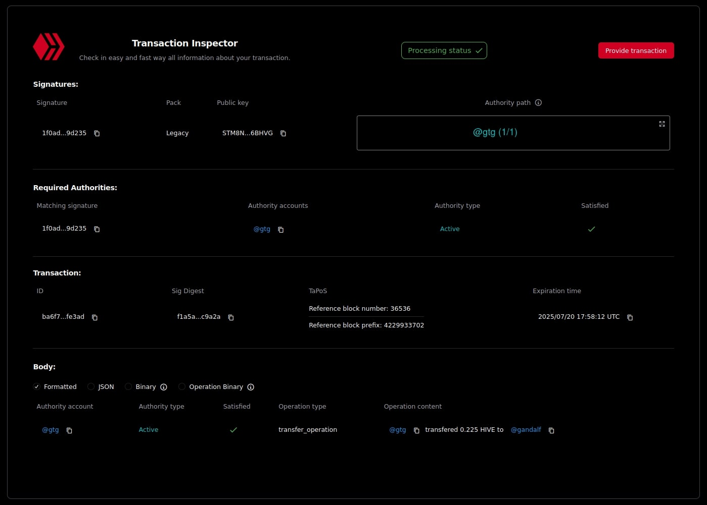

# Working with Online Transaction

The Online Transaction class extends the standard `ITransaction` interface implementation by adding functionality that requires chain API access. This provides enhanced verification capabilities and enables several important online transaction features that aren't available in offline transactions (such as created from TaPoS data, or directly using Protobuf or JSON objects).

## Overview

The Online Transaction class:

- Inherits from the base `ITransaction` class
- Adds online-specific functionality for chain verification
- Enables security checks for operations to prevent accidental key leaks
- Verifies account existence and authority requirements

## On-Chain Verification

One of the most powerful features of Online Transaction is the ability to perform on-chain verification:

+++ JavaScript

:::code source="../../../static/snippets/src/typescript/transaction/working-with-transaction/online-transaction/on-chain-verification.ts" language="typescript" title="Test it yourself: [src/typescript/transaction/working-with-transaction/online-transaction/on-chain-verification.ts](https://stackblitz.com/github/openhive-network/wax-doc-snippets?file=src%2Ftypescript%2Ftransaction%2Fworking-with-transaction%2Fonline-transaction%2Fon-chain-verification.ts&startScript=test-transaction-working-with-transaction-online-verification)" :::

+++ Python

TBA

+++

This verification process includes:

- Scanning for potential private key leaks in memos and comments
- Ensuring referenced accounts exist on the blockchain
- Validating authority changes in account operations

!!!secondary
This verification process is automatically performed **only on online transactions** before broadcasting them.
This way, you won't have to manually perform on-chain verification every time before broadcasting.
!!!

## On-Chain Operation Validation

The Online Transaction uses an internal on-chain operation validator class that performs various security checks:

1. **Private Key Leak Prevention**: Scans operation content (like memos and comments) for accidental inclusion of private keys
2. **Account Existence Verification**: Ensures referenced accounts exist on the blockchain
3. **Authority Modification Safety**: Checks for potentially dangerous authority changes

Example of what this prevents:

+++ JavaScript

:::code source="../../../static/snippets/src/typescript/transaction/working-with-transaction/online-transaction/on-chain-operation-validation.ts" language="typescript" title="Test it yourself: [src/typescript/transaction/working-with-transaction/online-transaction/on-chain-operation-validation.ts](https://stackblitz.com/github/openhive-network/wax-doc-snippets?file=src%2Ftypescript%2Ftransaction%2Fworking-with-transaction%2Fonline-transaction%2Fon-chain-operation-validation.ts&startScript=test-transaction-working-with-transaction-online-operation-validation)" :::

+++ Python

TBA

+++

## Authority Verification Trace

For debugging or advanced use cases, you can generate a detailed trace of authority verification:

+++ JavaScript

:::code source="../../../static/snippets/src/typescript/transaction/working-with-transaction/online-transaction/authority-verification-trace.ts" language="typescript" title="Test it yourself: [src/typescript/transaction/working-with-transaction/online-transaction/authority-verification-trace.ts](https://stackblitz.com/github/openhive-network/wax-doc-snippets?file=src%2Ftypescript%2Ftransaction%2Fworking-with-transaction%2Fonline-transaction%2Fauthority-verification-trace.ts&startScript=test-transaction-working-with-transaction-online-trace)" :::

==- Output

```javascript
{
  "collectedData": [
    {
      "finalAuthorityPath": {
        "processedEntry": "sandormb",
        "processedRole": "posting",
        "threshold": 1,
        "weight": 1,
        "recursionDepth": 0,
        "processingStatus": {
          "entryAccepted": true,
          "isOpenAuthority": false
        },
        "visitedEntries": [
          {
            "processedEntry": "STM5M43EiFVh7eobDsPWeGGDQqUZohxgoBmR25hoz5GHMhNhKDknm",
            "processedRole": "posting",
            "threshold": 1,
            "weight": 1,
            "recursionDepth": 0,
            "processingStatus": {
              "entryAccepted": true,
              "isOpenAuthority": false
            },
            "visitedEntries": []
          }
        ]
      },
      "matchingSignatures": [
        {
          "signature": "202cf9ea0754d1927a7875fdaf3aa6d743d7ffe4ccdc64059b9d6cb8e75ea1e5421e5d28d7205e6c820f8307c36e97b45da2bed6fa5795b3cf675020b77facdaee",
          "signatureKey": "STM5M43EiFVh7eobDsPWeGGDQqUZohxgoBmR25hoz5GHMhNhKDknm"
        }
      ]
    }
  ],
  "rootEntries": [
    {
      "processedEntry": "sandormb",
      "processedRole": "posting",
      "threshold": 1,
      "weight": 1,
      "recursionDepth": 0,
      "processingStatus": {
        "entryAccepted": true,
        "isOpenAuthority": false
      },
      "visitedEntries": [
        {
          "processedEntry": "STM5M43EiFVh7eobDsPWeGGDQqUZohxgoBmR25hoz5GHMhNhKDknm",
          "processedRole": "posting",
          "threshold": 1,
          "weight": 1,
          "recursionDepth": 0,
          "processingStatus": {
            "entryAccepted": true,
            "isOpenAuthority": false
          },
          "visitedEntries": []
        }
      ]
    }
  ],
  "rootEntry": {
    "processedEntry": "sandormb",
    "processedRole": "posting",
    "threshold": 1,
    "weight": 1,
    "recursionDepth": 0,
    "processingStatus": {
      "entryAccepted": true,
      "isOpenAuthority": false
    },
    "visitedEntries": [
      {
        "processedEntry": "STM5M43EiFVh7eobDsPWeGGDQqUZohxgoBmR25hoz5GHMhNhKDknm",
        "processedRole": "posting",
        "threshold": 1,
        "weight": 1,
        "recursionDepth": 0,
        "processingStatus": {
          "entryAccepted": true,
          "isOpenAuthority": false
        },
        "visitedEntries": []
      }
    ]
  },
  "finalAuthorityPath": [
    {
      "processedEntry": "sandormb",
      "processedRole": "posting",
      "threshold": 1,
      "weight": 1,
      "recursionDepth": 0,
      "processingStatus": {
        "entryAccepted": true,
        "isOpenAuthority": false
      },
      "visitedEntries": [
        {
          "processedEntry": "STM5M43EiFVh7eobDsPWeGGDQqUZohxgoBmR25hoz5GHMhNhKDknm",
          "processedRole": "posting",
          "threshold": 1,
          "weight": 1,
          "recursionDepth": 0,
          "processingStatus": {
            "entryAccepted": true,
            "isOpenAuthority": false
          },
          "visitedEntries": []
        }
      ]
    }
  ],
  "verificationStatus": {
    "entryAccepted": true,
    "isOpenAuthority": false
  }
}
```

===

+++ Python

TBA

+++

The trace can help understand:

- Which signatures were used
- Which authorities were satisfied
- What authorities are still missing
- The full verification path through nested authorities

By utilizing these features, we were able to create the [Transaction Inspector app](https://tx.openhive.network/):


